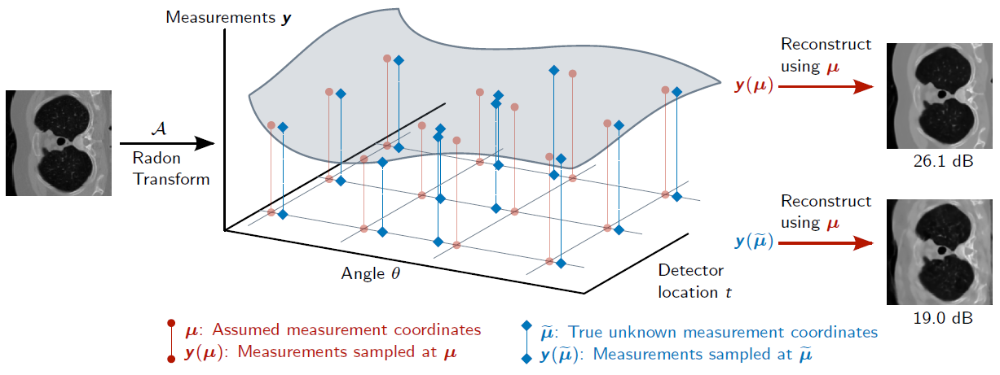

# Differentiable Uncalibrated Imaging

This repository contains the code for [Differentiable Uncalibrated Imaging](https://arxiv.org/abs/2211.10525). The paper is available at https://arxiv.org/abs/2211.10525.

<p float="center">

</p>

## Python setup
This code was developed with Python 3.9.12. Run the following code to install the conda environment provided in `environment.yml`:
```sh
conda env create -f environment.yml
```

There may be some `pip` failures which is alright. Package `ml-collections` may have to be explicitly installed using `pip`. Install it using `pip` of the newly created environment:
```sh
<PATH_TO_ANACONDA3_INSTALLATION>/envs/diff_imaging/bin/pip3 install ml-collections
```
where `<PATH_TO_ANACONDA3_INSTALLATION>` should be replaced with the path to your Anaconda 3 installation such as
```sh
~/anaconda3/envs/diff_imaging/bin/pip3 install ml-collections
```

Similarly install `odl`:
```sh
<PATH_TO_ANACONDA3_INSTALLATION>/envs/diff_imaging/bin/pip3 install git+https://github.com/odlgroup/odl.git@0b088df8dc4621c68b9414c3deff9127f4c4f11d
```

## Getting trained Unet models and data
Download trained Unets and the data from [here](https://uofi.box.com/s/zjicmxjljlam0csknf25hm7spt076c85) to the home directory of this repository.

## Solving inverse problems
Solve inverse problems by running the code:
```sh
mkdir work_directory
 python main.py --config=configs/<CONFIG_FILE> --config.workdir=work_directory
```

`<CONFIG_FILE>` should be replaced by the configuration file of the type of experiment you wish to run. These files are in the `configs/` directory and contain the experiment parameters:
- `ct_2d_implicit_neural_config.py`: 2D CT experiments using implicit neural measurement representations
- `ct_2d_spline_config.py`: 2D CT experiments using spline measurement representations
- `ct_3d_implicit_neural_config.py`: 3D CT experiments using implicit neural measurement representations
- `ct_3d_spline_config.py`: 3D CT experiments using spline measurement representations
These configuration files will use the downloaded trained Unets and data.

## Citing this work
If you find this code or the paper useful in your work, please consider citing the paper:

```
@article{gupta2022differentiable,
  title={Differentiable Uncalibrated Imaging},
  author={Gupta, Sidharth and Kothari, Konik and Debarnot, Valentin and Dokmani{\'c}, Ivan},
  journal={arXiv preprint arXiv:2211.10525},
  year={2022}
}
```
